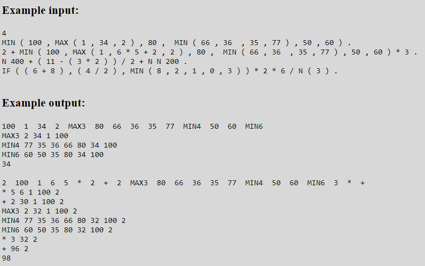

# ONP Calculator

## Description
ONP Calculator is an integer calculator that uses postfix notation (Odwrócona Notacja Polska) to handle operator precedence, functions, and parentheses. The calculator processes multiple formulas provided in infix notation and outputs the corresponding postfix notation, along with intermediate stack states and final results.

## Features
- **Infix to Postfix Conversion**: Converts infix expressions to postfix notation while respecting operator precedence and function arity.
- **Custom Data Structures**: Implements custom string, vector, and stack classes to avoid using standard library containers.
- **Unary and Binary Operations**: Supports unary negation, binary arithmetic operations, and conditional functions.
- **Min/Max Functions**: Handles `MIN` and `MAX` functions with variable arity.
- **Error Handling**: Detects and handles division by zero and insufficient operands.

## Input Format
1. **Number of Formulas**: The first line of input contains the number of formulas, `n`.
2. **Formulas**: The next `n` lines each contain a valid infix expression ending with a dot (`.`). Tokens are separated by whitespace. Operands are positive integers, operators are single characters, and function names consist only of capital letters.
3. **Operators and Functions**:
   - Binary operations: `+`, `-`, `*`, `/`
   - Unary operation: `N` (negation)
   - Conditional function: `IF(a, b, c)` (if `a > 0`, return `b`, else `c`)
   - Aggregate functions: `MIN(a1, a2, ...)`, `MAX(a1, a2, ...)`
   - Parentheses: `( ... )`

    

## Functions
- **`main()`**: The entry point of the program. Handles reading the input, converting infix expressions to postfix notation, and calculating the results.
- **`divideIntoTokens()`**: Splits the input string into tokens.
- **`checkIfOperator()`**: Checks if a character is an operator.
- **`determineOperatorPriority()`**: Determines the precedence of an operator.
- **`incrementLastOperator()`**: Increments the count of parameters for `MIN` or `MAX`.
- **`convertInfixToPostfix()`**: Converts an infix expression to postfix notation.
- **`calculatePostfixValue()`**: Calculates the result of a postfix expression and prints intermediate stack states.

## Custom Data Structures
- **`String`**: A custom string class to handle string operations.
- **`Vector`**: A custom vector class to manage dynamic arrays.
- **`Stack`**: A custom stack class for basic stack operations.
